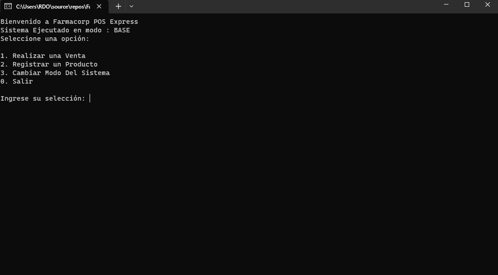
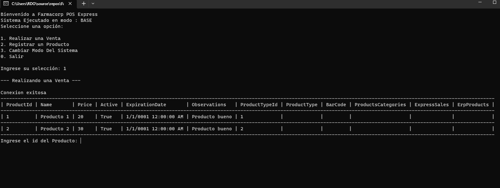
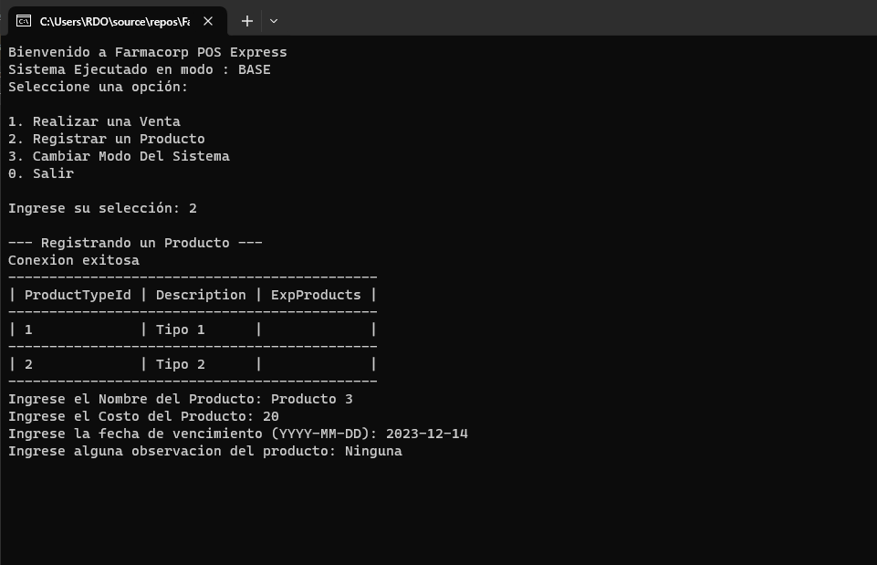
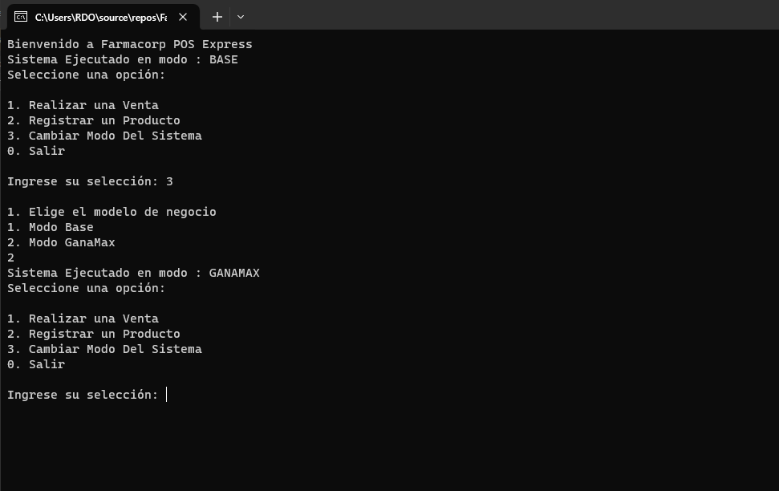

<div align="center">
    <h1>Farmacorp Pos Express</h1>
</div>
<p align="center">
    <a href="https://www.java.com/es/"></a>
    <a href="https://www.java.com/es/"></a>
    
</p>

## Estructura del Proyecto

- **Capa de Aplicación de Consola (ConsoleApp)** Capa de Presentacion que interactura con el usuario
- **Capa de Datos (Data):** Acceso y manejo de los datos en la base de datos.
- **Capa de Negocio (Business):** Lógica empresarial y reglas de dominio de la aplicación.
- **Capa de Modelos (Model):** Representación de objetos y entidades de datos del sistema.

## Configuración

- Clona el repositorio.
- Colocar el string de conexion de la clase `FarmacorpDbContext.cs`

```csharp
private string connectionString = "";
```

- Realizar la migracion para la base de datos

```shell
dotnet ef migrations add NOMBRE_DE_LA_MIGRACION
dotnet ef database update
```

- Ejecutar el archivo `Program.cs` de la capa ConsoleApp

## Capturas





